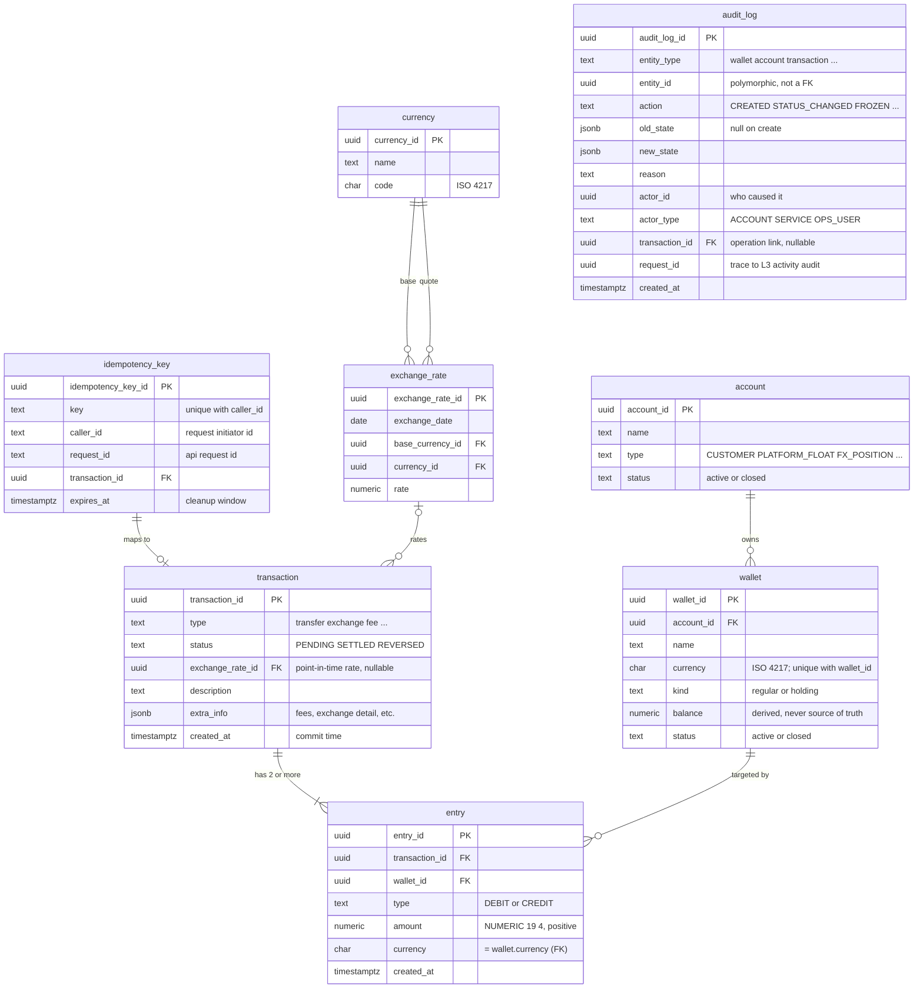

# Entity Relationship Diagram: Core Payments Ledger

Scope: the Section 2.1 entities, now expanded with the business attributes and
data types from the journal subsection "Expand the base ERD to have more
information". The base diagram only carried keys and relationships; this version
adds the named columns, the money/id data-type rules, and the two lookup
entities (`exchange_rate`, `currency`) called for in that subsection. It has since been
expanded and audited item by item: the Layer 2 `audit_log`, the chart of accounts, the
per-currency balance rule, immutability and currency-consistency guarantees, idempotency
scoping, and the FX worked example (full changelog in the journal).

> This document is being expanded and audited item by item (see the changelog in
> `../00-journal.md`, "ERD AI expansion and auditing"). Items intentionally kept out of the
> core ERD are noted as they come; settlement batching (a Task 3 concern) is one such item,
> delivered separately as the expand-contract migration in
> `../src/ddl/migrations/001_settlement_batch_id/`.
>
> Decisions encoded here, from the journal:
>
> - money is `NUMERIC(19,4)`, never floating point; ids are `UUID`;
> - **balance** is listed on `wallet` but is computed inside the transaction and
>   is **never the source of truth** (the entries are);
> - cross-currency value is captured through an `exchange_rate` lookup
>   (OANDA-style, one rate per date/pair), referenced by transactions that do an
>   exchange;
> - **currency** is a small lookup (`code`, `name`) referenced by `exchange_rate`;
> - **audit** is three layers: the ledger entries are Layer 1; an in-Postgres `audit_log`
>   (Layer 2) records committed non-ledger state changes; the Layer 3 activity log
>   (attempts, denials) stays a MongoDB append-only event log in a separate file
>   (`audit-l3-mongodb.md`).

## Diagram

## Entities

Trivial columns (`updated_at`, soft-delete flags, and the like) are omitted
unless named in the journal. Money is `NUMERIC(19,4)`; ids are `UUID`.

### account
A chart-of-accounts bucket that owns wallets. `type` gives its ledger role: `CUSTOMER` for
end users, plus the platform's own accounts: `PLATFORM_FLOAT` (real bank cash),
`PLATFORM_REVENUE` (fees earned), `MERCHANT_PAYABLE` (funds owed out), and `FX_POSITION`
(the FX desk). The platform accounts are what let a fee, a top-up, or an FX leg balance.

| Column | Type | Key | Notes |
|---|---|---|---|
| account_id | uuid | PK | |
| name | text | | |
| type | text | | chart of accounts: `CUSTOMER`, `PLATFORM_FLOAT`, `PLATFORM_REVENUE`, `MERCHANT_PAYABLE`, `FX_POSITION` [^air] |
| status | text | | `active`, `closed` |

Other references and attributes are left open by the journal ("depend on
specification") and are not modelled yet.

### wallet
A single-currency balance container under one account. `kind` distinguishes a `regular`
(spendable) wallet from a `holding` wallet, which temporarily holds that account's balance
while an external flow settles. The account's *role* (customer, FX desk, platform float,
...) lives on `account.type`, not here, so one account can hold both a regular and a
holding wallet per currency.

| Column | Type | Key | Notes |
|---|---|---|---|
| wallet_id | uuid | PK | |
| account_id | uuid | FK | -> `account(account_id)` |
| name | text | | |
| currency | char(3) | | currency is an attribute of the wallet (ISO 4217); `UNIQUE (wallet_id, currency)` is the target of the entry composite FK [^ai] |
| kind | text | | `regular` (spendable) or `holding` (held while an external flow settles) [^air] |
| balance | numeric(19,4) | | computed inside the transaction; **never the source of truth** |
| status | text | | `active`, `closed` |

### transaction
The journal header that groups the entries which must balance. Now carries the
business classification, lifecycle status, and the link to the rate used when the
movement crosses currencies.

| Column | Type | Key | Notes |
|---|---|---|---|
| transaction_id | uuid | PK | |
| type | text | | enum per spec: `transfer`, `exchange`, `fee`, ... |
| status | text | | `PENDING`, `SETTLED`, `REVERSED` [^air] |
| exchange_rate_id | uuid | FK | -> `exchange_rate`; the exact point-in-time rate record used (immutable, so the rate is pinned and a retry is deterministic); set only for exchange transactions, nullable otherwise |
| description | text | | |
| extra_info | jsonb | | detailed info (multi-currency legs, system fee, exchange value, ...) |
| created_at | timestamptz | | commit time of the transaction |

### entry
The double-entry line, one debit or one credit against one wallet. An immutable,
append-only fact: it carries no lifecycle `status` of its own (lifecycle lives on
`transaction`), and `amount` is a positive magnitude with direction in `type`.

| Column | Type | Key | Notes |
|---|---|---|---|
| entry_id | uuid | PK | |
| transaction_id | uuid | FK | -> `transaction` |
| wallet_id | uuid | FK | -> `wallet` (the target wallet) |
| type | text | | `DEBIT` or `CREDIT` |
| amount | numeric(19,4) | | always positive magnitude; direction is in `type`; `CHECK (amount > 0)` [^air] |
| currency | char(3) | | must equal the wallet's currency; enforced by composite FK `(wallet_id, currency)` -> `wallet`, both columns `NOT NULL` [^ai] |
| created_at | timestamptz | | |

> **Physical note** [^ai]: this ERD shows the logical model, so `entry`'s PK is `entry_id`.
> Physically the table **is** range-partitioned monthly on `created_at` (baseline DDL
> `initial/07_entry.up.sql`, the Task 2 work in journal section 3). PostgreSQL requires the
> partition key in the PK, so the physical PK is `(entry_id, created_at)`. Consequence:
> `entry_id` is then unique only together with `created_at`, not globally; this is safe here
> because `entry_id` is a UUID and nothing references `entry` by FK (it is a leaf). Non-unique
> secondary indexes (for example on `wallet_id`) do not need `created_at`.

### idempotency_key
Tracks the idempotency key so a duplicate request cannot post twice, and maps it to the
resulting transaction; also records who issued the request and which API request it came
from. This assumes each posting is **one atomic DB transaction** (the key is claimed in that
transaction, so a rollback releases it). A multi-step flow that commits each step separately
with non-rollback-able external calls in between is an out-of-scope edge case that would need
extra lifecycle state (a recovery point, locking), a redesign to make per the business flow.

| Column | Type | Key | Notes |
|---|---|---|---|
| idempotency_key_id | uuid | PK | |
| key | text | | unique per caller: `UNIQUE (caller_id, key)`; a duplicate is rejected [^air] |
| caller_id | text | | id of the request initiator (customer or system account); part of `UNIQUE (caller_id, key)` |
| request_id | text | | the API request id, distinct from the idempotency key |
| transaction_id | uuid | FK | -> the successful `transaction` |
| expires_at | timestamptz | | retention window; a cleanup/watchdog job sweeps expired keys (operational, not correctness) [^ai] |

### exchange_rate
Holds the exchange rate for a date and currency pair. The schema varies by
provider; this follows an OANDA-style shape. Referenced by transactions that do a
currency exchange so cross-currency movements stay reproducible.

| Column | Type | Key | Notes |
|---|---|---|---|
| exchange_rate_id | uuid | PK | |
| exchange_date | date | | the date the rate applies to |
| base_currency_id | uuid | FK | -> `currency` (the base) |
| currency_id | uuid | FK | -> `currency` (the quoted currency) |
| rate | numeric(19,8) | | rate carries more precision than a money value |

### currency
A small lookup of the currencies in use.

| Column | Type | Key | Notes |
|---|---|---|---|
| currency_id | uuid | PK | |
| name | text | | e.g. `US Dollar` |
| code | char(3) | | ISO 4217, e.g. `USD` |

Referenced by `exchange_rate` (base and quoted). The `currency` code on `wallet`
and `entry` is still carried directly as a string; normalizing those onto this
lookup is deferred.

### audit_log [^ai]
Layer 2 of the audit model: an in-Postgres, transactional record of committed state
changes to **non-ledger** entities (wallet freeze, KYC tier change, limit change). It audits
**all** entities through the polymorphic `(entity_type, entity_id)` pair, which is not a
drawable foreign key, so it is shown as a **detached** entity (no relationship lines) rather
than linked to any one table. `transaction_id` is only an optional pointer to the operation
that caused a change, when there is one. The ledger entries are Layer 1 and are their own
audit; the Layer 3 activity log (attempts, denials, access) is an append-only **MongoDB**
event log in a separate file (`audit-l3-mongodb.md`), so it is not a table here.

| Column | Type | Key | Notes |
|---|---|---|---|
| audit_log_id | uuid | PK | |
| entity_type | text | | `wallet`, `account`, `transaction`, ... |
| entity_id | uuid | | the changed row; polymorphic, so not modelled as a FK |
| action | text | | `CREATED`, `STATUS_CHANGED`, `FROZEN`, ... |
| old_state | jsonb | | null on create |
| new_state | jsonb | | |
| reason | text | | e.g. `ops_manual_review`, `bank_declined` |
| actor_id | uuid | | the account / user / service that caused the change |
| actor_type | text | | `ACCOUNT`, `SERVICE`, `OPS_USER` |
| transaction_id | uuid | FK | -> `transaction`; optional pointer to the operation that caused the change, nullable; not drawn as a relationship |
| request_id | uuid | | trace to the Layer 3 activity event |
| created_at | timestamptz | | |

Written in the same DB transaction as the change it describes, so it is always consistent
with committed state (and correctly disappears if that change rolls back). It does not
record ledger-transaction status: the entries already are that audit.

## Relationships

| From | To | Cardinality | Meaning |
|---|---|---|---|
| account | wallet | 1 : N | an account owns many wallets (one per currency, plus holding) |
| transaction | entry | 1 : 2..N | a transaction has two or more entries that balance |
| wallet | entry | 1 : N | a wallet is targeted by many entries; the link is a composite `(wallet_id, currency)` FK, so an entry's currency must match its wallet's |
| idempotency_key | transaction | 1 : 0..1 | a request maps to at most one transaction |
| exchange_rate | transaction | 1 : 0..N | an exchange transaction references one captured rate; non-exchange transactions reference none |
| currency | exchange_rate | 1 : 0..N | each rate names one base and one quoted currency drawn from the lookup |

`audit_log` is intentionally **not** in this table: it audits all entities through the
polymorphic `(entity_type, entity_id)` pair, which is not a drawable foreign key, so it is
shown as a detached entity rather than linked to any one table. [^ai]

## Integrity rules from the reasoning

- **Zero-sum, per currency.** [^air] Within each currency of a transaction,
  `SUM(amount WHERE type = DEBIT) = SUM(amount WHERE type = CREDIT)`. A same-currency
  transfer is one balanced pair; a cross-currency transfer is two balanced pairs (one per
  currency) bridged by the FX rate, which never enters the balance check. Enforced by a
  deferred constraint trigger or a check inside the DB transaction; a transaction that
  fails is rolled back. Grouping by currency matters because a currency-blind total can net
  to balanced while individual currencies are not: an imbalance in one currency can
  cross-cancel an imbalance in another, and a global check would accept it.
- **Immutability.** [^ai] `entry` rows are append-only: `REVOKE UPDATE, DELETE` from the
  app role. A posted entry is never edited or deleted; a transaction is undone only by
  posting a new reversing transaction (`status = REVERSED`). Lifecycle lives on
  `transaction.status`, and the entries themselves are the lifecycle audit.
- **Currency consistency.** [^ai] An entry's currency must equal its wallet's. Enforced by
  construction: `wallet` carries `UNIQUE (wallet_id, currency)` and `entry` has a composite
  FK `(wallet_id, currency)` -> `wallet`. Both entry columns are `NOT NULL`, so the check is
  never skipped (a NULL would bypass a composite FK under the default `MATCH SIMPLE`).
- **Idempotency.** The idempotency `key` is unique per caller (`UNIQUE (caller_id, key)`). A
  retried or duplicated request is rejected and mapped to the original transaction; `caller_id`
  and `request_id` give it traceability.
- **Derived balance.** `wallet.balance` is computed inside the transaction from
  the entries and is never trusted as the source of truth; the entries are.
- **Reconciliation.** [^ai] Because `wallet.balance` is a cache, a scheduled `balance_audit`
  compares it against the authoritative `SUM(entries)` per wallet and alerts on any nonzero
  discrepancy. Detailed checks and alerting are developed later (Task 5, observability).
- **Money and ids.** Money is `NUMERIC(19,4)` (no floating point); ids are `UUID`.

### Worked example: cross-currency transfer (FX bridge) [^ai]
A1 sends value to A2 so that A2 receives 1 USD, at 27,000 VND per USD. This is not one
cross-currency entry; it is two single-currency balanced legs routed through the
platform's FX-position wallets (`FX_VND`, `FX_USD`), in **one** transaction under **one**
idempotency key.

| wallet | type | amount | currency |
|---|---|---|---|
| A1_VND | DEBIT | 27000.0000 | VND |
| FX_VND | CREDIT | 27000.0000 | VND |
| FX_USD | DEBIT | 1.0000 | USD |
| A2_USD | CREDIT | 1.0000 | USD |

Per-currency check: VND DEBIT 27,000 = CREDIT 27,000, and USD DEBIT 1 = CREDIT 1. The rate
27,000 is captured on the transaction via `exchange_rate_id` (the point-in-time rate record),
with the exchange value in `extra_info`, and never enters the balance check. `FX_VND` /
`FX_USD` are wallets under an `FX_POSITION` account (the chart of accounts).

[^ai]: **AI-added** by the expansion/audit pass: an entity, column, relationship, or rule not in the original Section 2.1 work. Rationale and sources are in `../00-journal.md`, "ERD AI expansion and auditing".
[^air]: **AI-revised** from the original Section 2.1 work: an existing field or rule whose value or wording changed. The original value is preserved in `../00-journal.md`, "ERD AI expansion and auditing".
