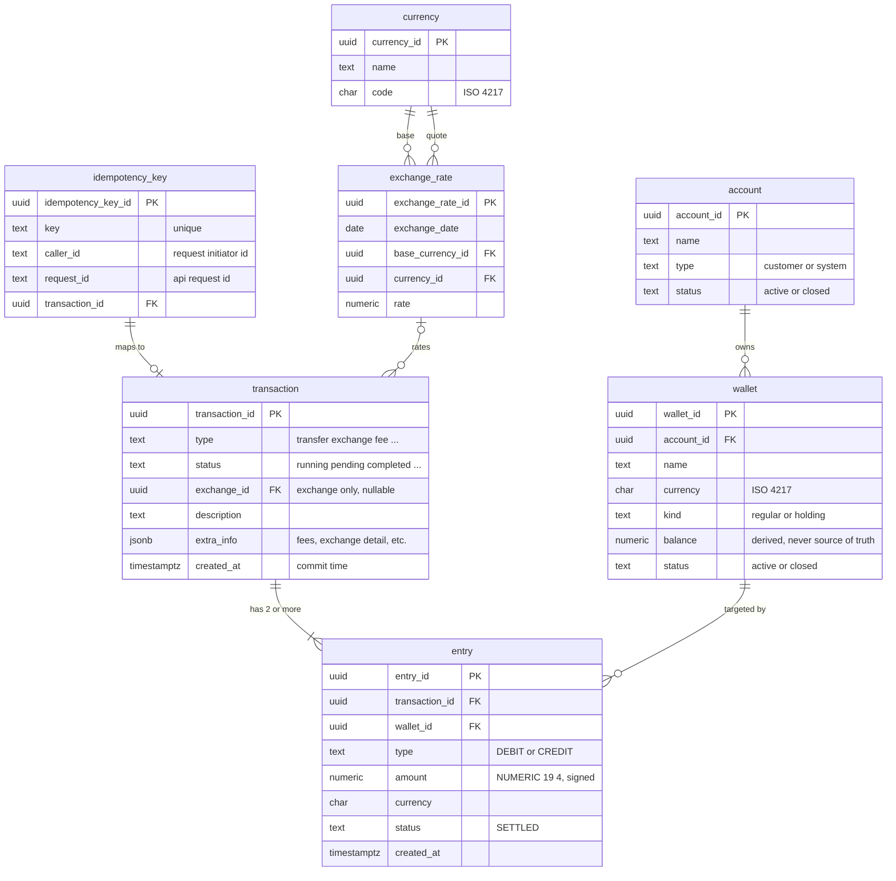

# Entity Relationship Diagram: Core Payments Ledger

Scope: the Section 2.1 entities, now expanded with the business attributes and
data types from the journal subsection "Expand the base ERD to have more
information". The base diagram only carried keys and relationships; this version
adds the named columns, the money/id data-type rules, and the two lookup
entities (`exchange_rate`, `currency`) called for in that subsection.

> This expansion stays inside the journal subsection. Further field additions and
> structural corrections (for example a composite `(wallet_id, currency)` key,
> an `audit_log` table, settlement batching) are deferred and processed later.
>
> Decisions encoded here, from the journal:
>
> - money is `NUMERIC(19,4)`, never floating point; ids are `UUID`;
> - **balance** is listed on `wallet` but is computed inside the transaction and
>   is **never the source of truth** (the entries are);
> - cross-currency value is captured through an `exchange_rate` lookup
>   (OANDA-style, one rate per date/pair), referenced by transactions that do an
>   exchange;
> - **currency** is a small lookup (`code`, `name`) referenced by `exchange_rate`;
> - **audit** stays at the application / MongoDB level (a separate section), so it
>   is still not a table here.

## Diagram

## Entities

Trivial columns (`updated_at`, soft-delete flags, and the like) are omitted
unless named in the journal. Money is `NUMERIC(19,4)`; ids are `UUID`.

### account
Owns wallets. A party that is either a customer or a house/system account.

| Column | Type | Key | Notes |
|---|---|---|---|
| account_id | uuid | PK | |
| name | text | | |
| type | text | | `customer`, `system` |
| status | text | | `active`, `closed` |

Other references and attributes are left open by the journal ("depend on
specification") and are not modelled yet.

### wallet
A single-currency balance container under one account. Holding wallets (in-flight
transfers) and house FX wallets are ordinary wallets distinguished by `kind`.

| Column | Type | Key | Notes |
|---|---|---|---|
| wallet_id | uuid | PK | |
| account_id | uuid | FK | -> `account(account_id)` |
| name | text | | |
| currency | char(3) | | currency is an attribute of the wallet (ISO 4217) |
| kind | | | `regular` or `holding` |
| balance | numeric(19,4) | | computed inside the transaction; **never the source of truth** |
| status | text | | `active`, `closed` |

### transaction
The journal header that groups the entries which must balance. Now carries the
business classification, lifecycle status, and the link to the rate used when the
movement crosses currencies.

| Column | Type | Key | Notes |
|---|---|---|---|
| transaction_id | uuid | PK | |
| type | text | | enum per spec: `transfer`, `exchange`, `fee`, ... |
| status | text | | `running`, `pending`, `completed`, ... |
| exchange_id | uuid | FK | -> `exchange_rate`; set only for exchange transactions, nullable otherwise |
| description | text | | |
| extra_info | jsonb | | detailed info (multi-currency legs, system fee, exchange value, ...) |
| created_at | timestamptz | | commit time of the transaction |

### entry
The double-entry line, one debit or one credit against one wallet. Unchanged from
the base diagram except that `amount` follows the money rule.

| Column | Type | Key | Notes |
|---|---|---|---|
| entry_id | uuid | PK | |
| transaction_id | uuid | FK | -> `transaction` |
| wallet_id | uuid | FK | -> `wallet` (the target wallet) |
| type | text | | `DEBIT` or `CREDIT` |
| amount | numeric(19,4) | | signed: `+` for CREDIT, `-` for DEBIT |
| currency | char(3) | | |
| status | text | | `SETTLED` |
| created_at | timestamptz | | |

### idempotency_key
Tracks the unique idempotency key so a duplicate request cannot post twice, and
maps it to the resulting transaction. Now also records who issued the request and
which API request it came from.

| Column | Type | Key | Notes |
|---|---|---|---|
| idempotency_key_id | uuid | PK | |
| key | text | UNIQUE | a duplicate is rejected |
| caller_id | text | | id of the request initiator (customer or system account) |
| request_id | text | | the API request id, distinct from the idempotency key |
| transaction_id | uuid | FK | -> the successful `transaction` |

### exchange_rate
Holds the exchange rate for a date and currency pair. The schema varies by
provider; this follows an OANDA-style shape. Referenced by transactions that do a
currency exchange so cross-currency movements stay reproducible.

| Column | Type | Key | Notes |
|---|---|---|---|
| exchange_rate_id | uuid | PK | |
| exchange_date | date | | the date the rate applies to |
| base_currency_id | uuid | FK | -> `currency` (the base) |
| currency_id | uuid | FK | -> `currency` (the quoted currency) |
| rate | numeric(19,8) | | rate carries more precision than a money value |

### currency
A small lookup of the currencies in use.

| Column | Type | Key | Notes |
|---|---|---|---|
| currency_id | uuid | PK | |
| name | text | | e.g. `US Dollar` |
| code | char(3) | | ISO 4217, e.g. `USD` |

Referenced by `exchange_rate` (base and quoted). The `currency` code on `wallet`
and `entry` is still carried directly as a string; normalizing those onto this
lookup is deferred.

## Relationships

| From | To | Cardinality | Meaning |
|---|---|---|---|
| account | wallet | 1 : N | an account owns many wallets (one per currency, plus holding) |
| transaction | entry | 1 : 2..N | a transaction has two or more entries that balance |
| wallet | entry | 1 : N | a wallet is targeted by many entries |
| idempotency_key | transaction | 1 : 0..1 | a request maps to at most one transaction |
| exchange_rate | transaction | 1 : 0..N | an exchange transaction references one captured rate; non-exchange transactions reference none |
| currency | exchange_rate | 1 : 0..N | each rate names one base and one quoted currency drawn from the lookup |

## Integrity rules from the reasoning

- **Zero-sum.** Each transaction's entries sum to zero (one `CREDIT` `+amount`,
  one `DEBIT` `-amount`, or more for FX). Enforced by a trigger or by a check
  inside the DB transaction; a transaction that fails the check is rolled back.
- **Idempotency.** The idempotency `key` is unique. A retried or duplicated
  request is rejected and mapped to the original transaction; `caller_id` and
  `request_id` give it traceability.
- **Derived balance.** `wallet.balance` is computed inside the transaction from
  the entries and is never trusted as the source of truth; the entries are.
- **Money and ids.** Money is `NUMERIC(19,4)` (no floating point); ids are `UUID`.
