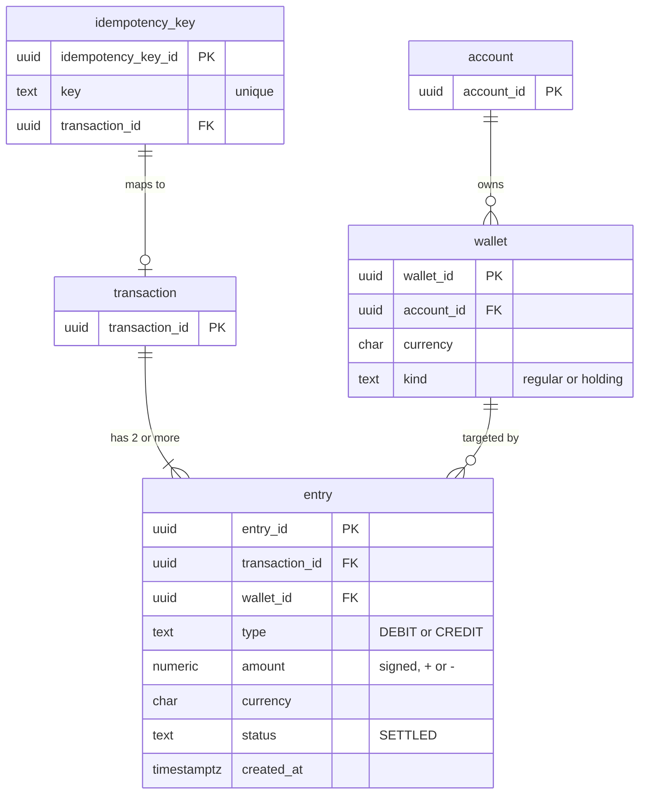

# Entity Relationship Diagram: Core Payments Ledger

Scope: the entities reasoned through in Section 2.1, and only those: accounts and
wallets, the double-entry split of the `transactions` table into `transaction`
and `entry`, and the idempotency key.

> This mirrors the Section 2.1 reasoning and is intentionally not expanded beyond
> it.
>
> - **FX** is handled by keeping one currency-pure wallet per currency plus house
>   exchange wallets (for example `A1_VND`, `FX_VND`, `FX_USD`, `A2_USD`), so it
>   needs no extra entity.
> - **Holding** wallets (in-flight transfers) are modelled as ordinary wallets
>   with a `kind`.
> - **Audit** is handled at the application level and offloaded to MongoDB or
>   another store (a separate section), so it is not a table here.

## Diagram

## Entities

### account
Owns wallets. Section 2.1 only establishes the ownership of multiple wallets.

| Column | Key | Notes |
|---|---|---|
| account_id | PK | |

### wallet
A single-currency balance container under one account. Holding wallets (in-flight
transfers) and house FX wallets are ordinary wallets.

| Column | Key | Notes |
|---|---|---|
| wallet_id | PK | |
| account_id | FK | -> `account` |
| currency | | currency is an attribute of the wallet |
| kind | | `regular` or `holding` |

### transaction
The journal header that groups the entries which must balance. The attributes of
the original `transactions` row moved down to `entry`, so the header is just the
grouping key.

| Column | Key | Notes |
|---|---|---|
| transaction_id | PK | |

### entry
The double-entry line, one debit or one credit against one wallet. This is what
the original `transactions` row really was.

| Column | Key | Notes |
|---|---|---|
| entry_id | PK | |
| transaction_id | FK | -> `transaction` |
| wallet_id | FK | -> `wallet` (the target wallet) |
| type | | `DEBIT` or `CREDIT` |
| amount | | signed: `+` for CREDIT, `-` for DEBIT |
| currency | | |
| status | | `SETTLED` |
| created_at | | |

### idempotency_key
Tracks the unique idempotency key so a duplicate request cannot post twice, and
maps it to the resulting transaction.

| Column | Key | Notes |
|---|---|---|
| idempotency_key_id | PK | |
| key | UNIQUE | a duplicate is rejected |
| transaction_id | FK | -> the successful `transaction` |

## Relationships

| From | To | Cardinality | Meaning |
|---|---|---|---|
| account | wallet | 1 : N | an account owns many wallets (one per currency, plus holding) |
| transaction | entry | 1 : 2..N | a transaction has two or more entries that balance |
| wallet | entry | 1 : N | a wallet is targeted by many entries |
| idempotency_key | transaction | 1 : 0..1 | a request maps to at most one transaction |

## Integrity rules from the reasoning

- **Zero-sum.** Each transaction's entries sum to zero (one `CREDIT` `+amount`,
  one `DEBIT` `-amount`, or more for FX). Enforced by a trigger or by a check
  inside the DB transaction; a transaction that fails the check is rolled back.
- **Idempotency.** The idempotency key is unique. A retried or duplicated request
  is rejected and mapped to the original transaction.
